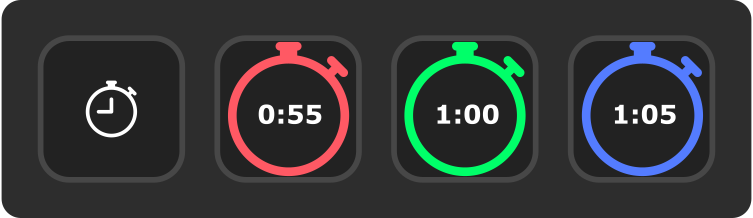

# Stopwatch Stream Deck Plugin

A stopwatch plugin for the Elgato Stream Deck.

  

## Features

- Add as many stopwatches as you need
- Start/stop a stopwatch with a single press
- Pause a stopwatch with a long press
- Configuration:
  - Text color
  - Frame color
  - Seconds indicator color
  - Show/hide seconds
  - Show/hide seconds indicator
  - Short press action
  - Long press action
  - Long press time

## Installation

### Manual Installation

- Download the latest plugin release [here](https://github.com/gabe565/streamdeck-stopwatch/releases/latest)
- Open downloaded `.sdplugin` file. It will be automatically installed to your Stream Deck application.
